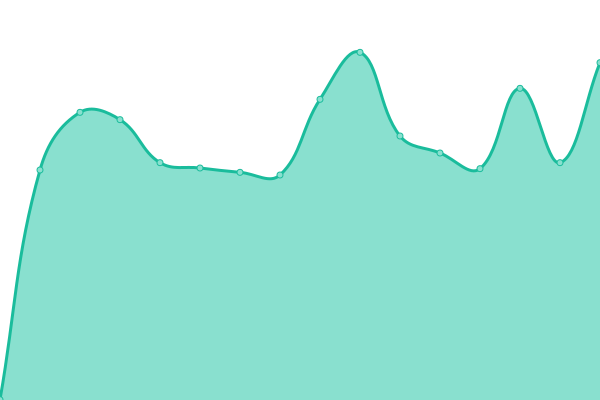

# [📈 Live Status](https://uptime.bdeak.net): <!--live status--> **🟧 Partial outage**

This repository contains the open-source uptime monitor and status page for [Bartol Deak](https://bdeak.net), powered by [Upptime](https://github.com/upptime/upptime).

With [Upptime](https://upptime.js.org), you can get your own unlimited and free uptime monitor and status page, powered entirely by a GitHub repository. We use [Issues](https://github.com/bdeak4/uptime/issues) as incident reports, [Actions](https://github.com/bdeak4/uptime/actions) as uptime monitors, and [Pages](https://uptime.bdeak.net) for the status page.

<!--start: status pages-->
<!-- This summary is generated by Upptime (https://github.com/upptime/upptime) -->
<!-- Do not edit this manually, your changes will be overwritten -->
<!-- prettier-ignore -->
| URL | Status | History | Response Time | Uptime |
| --- | ------ | ------- | ------------- | ------ |
|  [chatter](https://chatter.bdeak.net) | 🟥 Down | [chatter.yml](https://github.com/bdeak4/uptime/commits/HEAD/history/chatter.yml) | 

 2634ms
     
 | 

<a href="https://uptime.bdeak.net/history/chatter">0.00%</a>
    

|  [bdeak.net](https://bdeak.net) | 🟩 Up | [bdeak-net.yml](https://github.com/bdeak4/uptime/commits/HEAD/history/bdeak-net.yml) | 

 122ms
     
 | 

<a href="https://uptime.bdeak.net/history/bdeak-net">100.00%</a>
    

|  [ludo](https://ludo.bdeak.net) | 🟩 Up | [ludo.yml](https://github.com/bdeak4/uptime/commits/HEAD/history/ludo.yml) | 

 127ms
     
 | 

<a href="https://uptime.bdeak.net/history/ludo">100.00%</a>
    

|  [postsandcomments](https://postsandcomments.bdeak.net) | 🟩 Up | [postsandcomments.yml](https://github.com/bdeak4/uptime/commits/HEAD/history/postsandcomments.yml) | 

 119ms
     
 | 

<a href="https://uptime.bdeak.net/history/postsandcomments">100.00%</a>
    

|  [menze](https://menze.bdeak.net) | 🟩 Up | [menze.yml](https://github.com/bdeak4/uptime/commits/HEAD/history/menze.yml) | 

 832ms
     
 | 

<a href="https://uptime.bdeak.net/history/menze">100.00%</a>
    

<!--end: status pages-->

[**Visit our status website →**](https://uptime.bdeak.net)

## 📄 License

- Powered by: [Upptime](https://github.com/upptime/upptime)
- Code: [MIT](./LICENSE) © [Bartol Deak](https://bdeak.net)
- Data in the `./history` directory: [Open Database License](https://opendatacommons.org/licenses/odbl/1-0/)
